# 🌙 Luna – Inclusive & AI-first Voice Assistant

**Luna** is a voice assistant designed for people with visual impairments (and later adaptable to other disabilities).  
Its mission is to bring **autonomy, safety, and simplicity** to daily life through a **hybrid open-source architecture** and **AI-first governance**.

---

## ✨ Key Features

- 🎤 **Natural conversation** with GPT-4o Realtime (audio ↔ audio)  
- 📞 **Hands-free emergency calls** (112 / trusted contacts)  
- ⏰ **Reminders & timers** via voice  
- 📧 **Gmail integration** (read, summarize, draft replies)  
- 🎶 **Spotify** (playlists, playback control)  
- 📄 **Document scanning & classification** (OCR → save + smart search)  
- 📅 **Agenda management** (local or Google Calendar sync)  
- 🌐 **Web search** adapted for audio-first answers  

---

## 🛠️ Getting Started

1. Clone the repository and enter the workspace:
   ```bash
   git clone https://github.com/luna-assistant-ai/luna-assistant-ai-core.git
   cd luna-assistant-ai-core
   ```
2. Install prerequisites (Rust ≥ 1.81, Xcode for iOS, Node.js for the OAuth backend). If you do not have Rust yet, run `rustup default stable` after installing rustup.
   > Note: The `core/` crate and client apps will appear as code lands in this repository. If you cloned a skeleton repo without those folders yet, keep an eye on the roadmap section or GitHub issues for the drop.
3. Bootstrap the core crate to verify your toolchain:
   ```bash
   cd core
   cargo test
   cargo build
   ```
4. (Optional) Open the iOS client to run Luna on a simulator:
   ```bash
   open ../clients/ios/App.xcodeproj
   ```
   Then press `Cmd + R` inside Xcode. Refer to the sections below for more platform-specific instructions, environment variables, and integration secrets.
   Additional deep-dive guides will live in the [`luna-assistant-ai-docs`](https://github.com/luna-assistant-ai/luna-assistant-ai-docs) repository as they are published.

---

## 🏗️ Technical Architecture

### Core (Rust)
- Event bus + intent detection  
- Modular plugins (skills): SOS, reminders, OCR, Gmail, Spotify, search  
- Exposed via FFI (iOS/Android) or service (Raspberry Pi)  

### Clients
- 📱 **iOS (SwiftUI)** – first target  
- 🤖 Android (Jetpack Compose) – planned  
- 💻 Raspberry Pi Hub (mic + speaker + SOS button) – planned  

### Cloud
- **OpenAI GPT-4o Realtime** (audio ↔ audio)  
- Lightweight backend (ephemeral keys, OAuth callbacks)  

### Architecture Diagram

```mermaid
flowchart LR
    subgraph Clients
        iOS["iOS (SwiftUI)"]
        Android["Android (Jetpack Compose)"]
        Pi["Raspberry Pi Hub"]
    end

    subgraph Core
        EventBus["Event Bus"]
        Intents["Intent Detection"]
        Skills["Skills · SOS/OCR/Reminders/Gmail/Spotify/Search"]
    end

    subgraph Cloud
        Realtime["GPT-4o Realtime"]
        Backend["Lightweight Backend"]
        Copilots["AI Copilots · CrewAI/AutoGen"]
    end

    Clients -->|"FFI / Local Service"| Core
    Core -->|"Ephemeral Keys / APIs"| Cloud
    Copilots -->|"PRDs / ADRs / Issues"| Zenhub((Zenhub))
    Copilots -->|Guidance| Maintainers((Core Team))
    Maintainers -->|Deploy / Release| Clients
```



---

## 🤖 AI-first Governance

Luna is guided by an **AI board of copilots**, orchestrated with **CrewAI** (execution pipelines) and **AutoGen** (exploratory debates).

### AI Copilots
- **Marketing AI** → competitive benchmarking, user studies (visually impaired in NZ), market sizing  
- **Finance AI** → cost analysis, financial forecasting, ROI scenarios  
- **Tech AI** → architecture choices, infra costs, security validation  
- **Legal AI** → GDPR/NZ compliance, open-source licenses, funding opportunities  

### Orchestration
- **CrewAI** → structured pipelines, outputs PRDs/ADRs/issues for Zenhub  
- **AutoGen** → exploratory debates, multi-criteria arbitration with human-in-the-loop  

---

## 🔑 Open Source Strategy

### Hybrid Model
- **Public (open source)**  
  - Rust Core (event bus, intents API)  
  - Minimal iOS/Android clients  
  - Essential skills: SOS, reminders, basic OCR  

- **Private (proprietary)**  
  - AI Copilots (Marketing, Finance, Legal, Tech)  
  - Premium integrations (advanced Gmail, Spotify, LLM-powered search)  
  - Caregiver dashboard (activity insights, opt-in sharing)  

### License Choice
- **Core & clients**: MIT → maximize adoption and contributions  
- **Premium modules**: proprietary license (e.g., SSPL or BUSL to restrict commercial reuse)  

### GitHub Structure
- Public repo: `luna-assistant-ai-core` (Rust + clients + docs)  
- Public repo: `luna-assistant-ai-docs` (guides, accessibility docs, prompts)  
- Private repo: `luna-assistant-ai-pro` (AI copilots, premium integrations)  
- GitHub organization: `luna-assistant-ai/`  

### Community Governance
- **Maintainers**: core team (Rust/iOS/Android devs)  
- **External contributors**: PR → human review required → CI/CD green → auto-merge via Mergify  
- **CONTRIBUTING.md**: clear rules (tests, accessibility, Conventional Commits)  
- **CODE_OF_CONDUCT.md**: inclusivity & respect  
- **Public roadmap** (Zenhub boards in read-only)  
- **GitHub Discussions**: open channel for visually impaired users & caregivers  

---

## 🚀 Development & CI/CD

### Requirements
- [Rust](https://www.rust-lang.org/tools/install) ≥ 1.81  
- [Xcode](https://developer.apple.com/xcode/) (iOS)  
- [Node.js](https://nodejs.org/) (OAuth backend)  
- [Drone CI](https://www.drone.io/) (CI/CD)  

### Build the Core
```bash
cd core
cargo test
cargo build --release

Generate XCFramework (iOS)
bash core/build-ios.sh

Run the iOS App
open clients/ios/App.xcodeproj
# Cmd + R in Xcode

CI/CD Workflow
Drone CI → build, test, iOS artifacts, Raspberry Pi Docker image
Mergify → auto-merge if CI passes + review approved
Zenhub → backlog & roadmap fed by CrewAI pipelines

🛡️ Security & Privacy
🔑 Ephemeral keys for Realtime (never stored client-side)
🔒 Local data encrypted (SQLite + Keychain/Keystore)
🚫 No voice recordings stored by default (opt-in only)
✅ Critical actions (e.g., 112 calls) require vocal confirmation

🧩 Roadmap
MVP (3–4 months)
Rust Core + iOS app (Realtime audio)
SOS, reminders, basic OCR skills
CrewAI orchestrating Marketing→Finance→Tech→Legal
First user tests (NZ, 5–10 people)
Phase 2 (6–8 months)
Gmail, Spotify, smart search
AutoGen for exploratory debates
Raspberry Pi hub (offline fallback)
Phase 3 (12 months)
Android client
Accessibility extensions (Braille, eye-tracking)
Partnerships with associations & public funding

👩‍💻 Contribution
Fork + branch (feat/...)
Run tests (cargo test, xcodebuild test)
Open PR with template (objective, tests, accessibility, rollback)
Human review required → CI green → Mergify auto-merge
Conventions
Commits → Conventional Commits
Branches → feat/..., fix/...
PRs → small, tested, documented

📜 License
Core: MIT (open source)
Basic clients: MIT
Premium modules (AI copilots, advanced integrations): proprietary license
