# 🌙 Luna – Inclusive & AI-first Voice Assistant

**Luna** is a voice assistant designed for people with visual impairments (and later adaptable to other disabilities).  
Its mission is to bring **autonomy, safety, and simplicity** to daily life through a **hybrid open-source architecture** and **AI-first governance**.

---

## ✨ Key Features

- 🎤 **Natural conversation** with GPT-4o Realtime (audio ↔ audio)  
- 📞 **Hands-free emergency calls** (112 / trusted contacts)  
- ⏰ **Reminders & timers** via voice  
- 📧 **Gmail integration** (read, summarize, draft replies)  
- 🎶 **Spotify** (playlists, playback control)  
- 📄 **Document scanning & classification** (OCR → save + smart search)  
- 📅 **Agenda management** (local or Google Calendar sync)  
- 🌐 **Web search** adapted for audio-first answers  

---

## 🛡️ Security & Privacy First

- 🔑 No API keys stored on device (ephemeral credentials only)  
- 🔒 All local data encrypted (SQLite + system keychain/keystore)  
- 🚫 Zero voice recordings by default (opt-in storage only)  
- ✅ Critical actions require vocal confirmation (e.g., “Yes, call emergency”)  

---

## ⚡ Quick Demo

1. Clone & enter the workspace:
   ```bash
   git clone https://github.com/luna-assistant-ai/luna-assistant-ai-core.git
   cd luna-assistant-ai-core
   ```
2. Test and build the core crate:
   ```bash
   cd core
   cargo test
   cargo build
   ```
3. No code yet? Watch [@luna-assistant-ai](https://github.com/luna-assistant-ai) to get notified when the first modules land.

---

## 🛠️ Getting Started

1. Clone the repository and enter the workspace:
   ```bash
   git clone https://github.com/luna-assistant-ai/luna-assistant-ai-core.git
   cd luna-assistant-ai-core
   ```
2. Install prerequisites:
   - Rust ≥ 1.81 (required)  
   - Xcode for iOS development (required if you target iOS)  
   - Node.js (optional — only for local OAuth backend testing)  
   If you do not have Rust yet, run `rustup default stable` after installing rustup.
   > Note: The `core/` crate and client apps will appear as code lands in this repository. If you cloned a skeleton repo without those folders yet, keep an eye on the roadmap section or GitHub issues for the drop.
3. Bootstrap the core crate to verify your toolchain:
   ```bash
   cd core
   cargo test
   cargo build
   ```
4. (Optional) Open the iOS client to run Luna on a simulator:
   ```bash
   open ../clients/ios/App.xcodeproj
   ```
   Then press `Cmd + R` inside Xcode. Refer to the sections below for more platform-specific instructions, environment variables, and integration secrets.
   Additional deep-dive guides will live in the [`luna-assistant-ai-docs`](https://github.com/luna-assistant-ai/luna-assistant-ai-docs) repository as they are published.

**Not ready to code yet?**  
- ⭐ Star this repo to get notified of first commits  
- 💬 Join [Discussions](https://github.com/luna-assistant-ai/luna-assistant-ai-core/discussions) to shape the roadmap  
- 📖 Browse accessibility research and guidelines in [`luna-assistant-ai-docs`](https://github.com/luna-assistant-ai/luna-assistant-ai-docs) (coming soon)  

---

## 📁 Repository Structure

- **[luna-assistant-ai-core](./)** ← you are here (Rust engine, FFI bindings, basic clients)  
- **[luna-assistant-ai-docs](https://github.com/luna-assistant-ai/luna-assistant-ai-docs)** (guides, accessibility standards, prompt library)  
- **[luna-assistant-ai-pro](https://github.com/luna-assistant-ai/luna-assistant-ai-pro)** — private (AI copilots, premium integrations, caregiver dashboard)  
- **[@luna-assistant-ai](https://github.com/luna-assistant-ai)** (organization-level roadmap & discussions)  

---

## 🏗️ Technical Architecture

### Core (Rust)
- Event bus + intent detection  
- Modular plugins (skills): SOS, reminders, OCR, Gmail, Spotify, search  
- Exposed via FFI (iOS/Android) or service (Raspberry Pi)  

### Clients
- 📱 **iOS (SwiftUI)** – first target  
- 🤖 Android (Jetpack Compose) – planned  
- 💻 Raspberry Pi Hub (mic + speaker + SOS button) – planned  

### Cloud
- **OpenAI GPT-4o Realtime** (audio ↔ audio)  
- Lightweight backend (ephemeral keys, OAuth callbacks)  

### Architecture Diagram

```mermaid
flowchart TD
    User["👤 User (Voice)"]

    subgraph Device["📱 Device"]
        App["iOS/Android App"]
        Core["🦀 Rust Core"]
        Skills["🔧 Skills\nSOS • OCR • Reminders"]
    end

    subgraph Services["☁️ External Services"]
        GPT["🎤 GPT-4o Realtime"]
        Gmail["📧 Gmail API"]
        Emergency["🚨 Emergency Services"]
    end

    User <--> App
    App <--> Core
    Core <--> Skills
    Skills --> GPT
    Skills --> Gmail
    Skills --> Emergency

    style User fill:#e1f5fe
    style Skills fill:#f3e5f5
    style Emergency fill:#ffebee
```



*Luna's governance and development process (including AI-assisted analysis) is detailed in the [AI-Assisted Governance](#-ai-assisted-governance-human-in-the-loop) section below.*

---

## 🏗️ Architecture Decisions

- **Why Rust core?** Deterministic performance and memory safety for accessibility-critical flows.  
- **Why AI copilots?** Scale expert analysis (compliance, forecasting, benchmarking) in a niche domain with limited human bandwidth.  
- **Why hybrid licensing?** Keep the foundation open-source while funding long-term accessibility R&D through premium integrations.

---

## 🤖 AI-Assisted Governance (Human-in-the-Loop)

Luna leverages AI copilots to scale strategic analysis in accessibility—a domain where specialized expertise is scarce—while maintaining strict human oversight on all decisions.

### Decision Flow

```
AI Strategic Analysis → Human Review → Community Input → Final Decision
```

**What AI handles:**
- Market intelligence & competitive positioning analysis  
- Product strategy recommendations & feature prioritization  
- Operational modeling & unit economics forecasting  
- Risk assessment & regulatory compliance mapping  

**What humans control:**
- All strategic decisions affecting users and roadmap  
- Safety-critical features (emergency calls, data privacy)  
- Community governance and contributor policies  
- Final product releases and partnership agreements  

### AI Copilot Teams

| Copilot | Strategic Focus | Business-Critical Questions |
|---------|-----------------|-----------------------------|
| **Market Intelligence** | Competitive positioning & user acquisition | "Which accessibility gaps can we own vs. competitors?" "What drives switching from existing solutions?" |
| **Product Strategy** | Feature prioritization & roadmap | "Which skills unlock highest user retention?" "When do we expand beyond visual impairments?" |
| **Operations** | Scalability & unit economics | "At what user volume do we need dedicated infrastructure?" "Which premium features justify subscription pricing?" |
| **Risk Management** | Regulatory compliance & reputation | "What liability exposure from emergency call failures?" "How do privacy regulations limit personalization?" |

### Strategic Output Examples

**Market Intelligence:**  
> "Voiceitt and Be My Eyes dominate communication, not autonomy. Emergency calling gap = 47% of target users underserved. Entry strategy: own the safety vertical first."

**Product Strategy:**  
> "User retention analysis: Emergency features drive 89% retention vs 34% for entertainment features. Prioritize SOS + medication reminders over Spotify integration."

**Operations:**  
> "GPT-4o cost trajectory: $0.08/user at 1K users → $0.03/user at 10K users. Break-even with freemium: 2,500 active users minimum or $15/month premium tier."

**Risk Management:**  
> "Emergency call liability: NZ accident compensation covers technology failures. Key risk = false positives. Mitigation: 3-second confirmation + voice pattern recognition."

### Safeguards in Place

- 🔒 **No autonomous decisions**: All AI outputs require maintainer approval  
- 👥 **Community visibility**: Major decisions discussed in public GitHub discussions  
- 🛡️ **Safety override**: Human veto on any AI recommendation, no questions asked  
- 📊 **Transparency**: AI-generated reports tagged and publicly available  

*Think of it as having a strategic consulting team that never sleeps, but your human judgment always has the final say.*

---

## 🔑 Open Source Strategy

### Hybrid Model
- **Public (open source)**  
  - Rust Core (event bus, intents API)  
  - Minimal iOS/Android clients  
  - Essential skills: SOS, reminders, basic OCR  

- **Private (proprietary)**  
  - AI Copilots (Marketing, Finance, Legal, Tech)  
  - Premium integrations (advanced Gmail, Spotify, LLM-powered search)  
  - Caregiver dashboard (activity insights, opt-in sharing)  

### License Choice
- **Core & clients**: MIT → maximize adoption and contributions  
- **Premium modules**: proprietary license (e.g., SSPL or BUSL to restrict commercial reuse)  

### Community Governance
- **Maintainers**: core team (Rust/iOS/Android devs)  
- **External contributors**: PR → human review required → CI/CD green → auto-merge via Mergify  
- **CONTRIBUTING.md**: clear rules (tests, accessibility, Conventional Commits)  
- **CODE_OF_CONDUCT.md**: inclusivity & respect  
- **GitHub Projects**: public roadmap & prioritization  
- **GitHub Discussions**: open channel for visually impaired users & caregivers  

---

## 🛠 Development Workflow

**Project Management:**
- **GitHub Projects** → Public roadmap & feature tracking  
- **GitHub Issues** → Bug reports, accessibility requirements  
- **GitHub Discussions** → Community feedback & early testing signup  

**CI/CD Pipeline:**
- **Drone CI** → Multi-platform builds (iOS, Android, Raspberry Pi Docker images)  
- **Mergify** → Auto-merge when Drone CI passes + review approved  
- **AI Copilots** → Generate PRDs/ADRs/issues directly to GitHub Projects  

---

## 🛣️ Roadmap & Status *(last updated: December 2024)*

- **Weeks 1–4**: Core engine scaffold + iOS skeleton → first public commit  
- **Months 1–2**: SOS + Reminders skills → closed alpha with testers in NZ  
- **Months 3–4**: OCR pipeline + end-to-end voice loop → MVP release and feedback cycle  
- **Post-MVP**: Gmail/Spotify integrations, Raspberry Pi hub, AI governance pilots shared via Docs repo  

Progress snapshots and issues live in GitHub Projects boards and GitHub Discussions.

---

## 👩‍💻 Contributing

Luna thrives on community input—especially from people with lived accessibility experience. Whether you are new to open source or a seasoned maintainer, we can pair you with a starter issue or mentoring buddy.

- Fork then branch (`feat/...`, `fix/...`)  
- Run tests (`cargo test`, `xcodebuild test`) before opening a PR  
- Fill the PR template (objective, tests, accessibility, rollback)  
- Human review required → CI green → Mergify auto-merge  
- Follow Conventional Commits and keep PRs small, tested, documented  

---

## 🤝 Get Involved

- **Users with visual impairments**: Join early testing via [GitHub Discussions](https://github.com/luna-assistant-ai/luna-assistant-ai-core/discussions)  
- **Developers**: Pick up tasks in [Issues](https://github.com/luna-assistant-ai/luna-assistant-ai-core/issues) and review [CONTRIBUTING.md](./CONTRIBUTING.md)  
- **Organizations & partners**: Start a thread in [GitHub Discussions](https://github.com/luna-assistant-ai/luna-assistant-ai-core/discussions)  
- **Community**: Watch [@luna-assistant-ai](https://github.com/luna-assistant-ai) for release updates  

---

## 📜 License

- Core: MIT (open source)  
- Basic clients: MIT  
- Premium modules (AI copilots, advanced integrations): proprietary license  
