# 🌙 Luna – Inclusive & AI-first Voice Assistant

**Luna** is a voice assistant designed for people with visual impairments (and later adaptable to other disabilities).  
Its mission is to bring **autonomy, safety, and simplicity** to daily life through a **hybrid open-source architecture** and **AI-first governance**.

---

## ✨ Key Features

- 🎤 **Natural conversation** with GPT-4o Realtime (audio ↔ audio)  
- 📞 **Hands-free emergency calls** (112 / trusted contacts)  
- ⏰ **Reminders & timers** via voice  
- 📧 **Gmail integration** (read, summarize, draft replies)  
- 🎶 **Spotify** (playlists, playback control)  
- 📄 **Document scanning & classification** (OCR → save + smart search)  
- 📅 **Agenda management** (local or Google Calendar sync)  
- 🌐 **Web search** adapted for audio-first answers  

---

## 🛡️ Security & Privacy First

- 🔑 No API keys stored on device (ephemeral credentials only)  
- 🔒 All local data encrypted (SQLite + system keychain/keystore)  
- 🚫 Zero voice recordings by default (opt-in storage only)  
- ✅ Critical actions require vocal confirmation (e.g., “Yes, call emergency”)  

---

## ⚡ Quick Demo

1. Clone & enter the workspace:
   ```bash
   git clone https://github.com/luna-assistant-ai/luna-assistant-ai-core.git
   cd luna-assistant-ai-core
   ```
2. Test and build the core crate:
   ```bash
   cd core
   cargo test
   cargo build
   ```
3. No code yet? Watch [@luna-assistant-ai](https://github.com/luna-assistant-ai) to get notified when the first modules land.

---

## 🛠️ Getting Started

1. Clone the repository and enter the workspace:
   ```bash
   git clone https://github.com/luna-assistant-ai/luna-assistant-ai-core.git
   cd luna-assistant-ai-core
   ```
2. Install prerequisites:
   - Rust ≥ 1.81 (required)  
   - Xcode for iOS development (required if you target iOS)  
   - Node.js (optional — only for local OAuth backend testing)  
   If you do not have Rust yet, run `rustup default stable` after installing rustup.
   > Note: The `core/` crate and client apps will appear as code lands in this repository. If you cloned a skeleton repo without those folders yet, keep an eye on the roadmap section or GitHub issues for the drop.
3. Bootstrap the core crate to verify your toolchain:
   ```bash
   cd core
   cargo test
   cargo build
   ```
4. (Optional) Open the iOS client to run Luna on a simulator:
   ```bash
   open ../clients/ios/App.xcodeproj
   ```
   Then press `Cmd + R` inside Xcode. Refer to the sections below for more platform-specific instructions, environment variables, and integration secrets.
   Additional deep-dive guides will live in the [`luna-assistant-ai-docs`](https://github.com/luna-assistant-ai/luna-assistant-ai-docs) repository as they are published.

**Not ready to code yet?**  
- ⭐ Star this repo to get notified of first commits  
- 💬 Join [Discussions](https://github.com/luna-assistant-ai/luna-assistant-ai-core/discussions) to shape the roadmap  
- 📖 Browse accessibility research and guidelines in [`luna-assistant-ai-docs`](https://github.com/luna-assistant-ai/luna-assistant-ai-docs) (coming soon)  

---

## 📁 Repository Structure & Development

- **[luna-assistant-ai-core](./)** ← you are here  
  - Rust engine, FFI bindings, iOS client (solo development + multi-AI governance)  
- **[luna-assistant-ai-docs](https://github.com/luna-assistant-ai/luna-assistant-ai-docs)**  
  - User guides, accessibility standards, AI governance documentation  
- **Development Tools**  
  - VS Code + Continue plugin, CrewAI + AutoGen orchestration  
- **Strategic Planning**  
  - Multi-AI domain teams for comprehensive business analysis  

---

## 🏗️ Technical Architecture

### Core (Rust)
- Event bus + intent detection  
- Modular plugins (skills): SOS, reminders, OCR, Gmail, Spotify, search  
- Exposed via FFI (iOS/Android) or service (Raspberry Pi)  

### Clients
- 📱 **iOS (SwiftUI)** – first target  
- 🤖 Android (Jetpack Compose) – planned  
- 💻 Raspberry Pi Hub (mic + speaker + SOS button) – planned  

### Cloud
- **OpenAI GPT-4o Realtime** (audio ↔ audio)  
- Lightweight backend (ephemeral keys, OAuth callbacks)  

### Architecture Diagram

```mermaid
flowchart TD
    User["👤 User (Voice)"]

    subgraph Device["📱 Device"]
        App["iOS/Android App"]
        Core["🦀 Rust Core"]
        Skills["🔧 Skills\nSOS • OCR • Reminders"]
    end

    subgraph Services["☁️ External Services"]
        GPT["🎤 GPT-4o Realtime"]
        Gmail["📧 Gmail API"]
        Emergency["🚨 Emergency Services"]
    end

    subgraph Governance["🤖 AI Governance"]
        CrewAI["CrewAI Teams\nLegal • Marketing • Tech • Finance"]
        AutoGen["AutoGen\nDecision Debates"]
    end

    User <--> App
    App <--> Core
    Core <--> Skills
    Skills --> GPT
    Skills --> Gmail
    Skills --> Emergency
    CrewAI -.-> AutoGen
    AutoGen -.-> Core

    style User fill:#e1f5fe
    style Skills fill:#f3e5f5
    style Emergency fill:#ffebee
    style Governance fill:#f8f9fa
```



*Luna's detailed AI governance and solo development approach is explained in the [AI-Native Development & Governance](#-ai-native-development--governance) section below.*

---

## 🏗️ Architecture Decisions

- **Why Rust core?** Deterministic performance and memory safety for accessibility-critical flows.  
- **Why AI copilots?** Scale expert analysis (compliance, forecasting, benchmarking) in a niche domain with limited human bandwidth.  
- **Why hybrid licensing?** Keep the foundation open-source while funding long-term accessibility R&D through premium integrations.

---

## 🤖 AI-Native Development & Governance

Luna combines solo development with a sophisticated multi-AI governance system, ensuring both rapid execution and comprehensive strategic oversight across all business domains.

### Development Philosophy
```
Strategic Governance (Multi-AI Teams) → Solo Implementation → Community Validation
```

**Why this approach?**
- **Vision coherence**: Single developer ensures accessibility-first standards throughout  
- **Strategic depth**: Specialized AI teams provide expert analysis across all business domains  
- **Rapid execution**: No coordination overhead, direct implementation from validated decisions  
- **Quality control**: Critical accessibility features developed with maximum care and consistency  

### AI Governance Structure

#### **Specialized Domain Teams (CrewAI Orchestration)**

| Domain | AI Agents | Focus Areas |
|--------|-----------|-------------|
| **Legal** | Claude + GPT-4 | GDPR compliance, emergency call liability, medical device regulations, IP strategy |
| **Marketing** | Claude + GPT-4 | Competitive analysis, user research synthesis, positioning, partnership opportunities |
| **Technical** | Continue + Claude | Architecture decisions, performance optimization, security implementation, scalability |
| **Finance** | Claude + GPT-4 | Unit economics, pricing strategy, funding opportunities, cost optimization |

#### **Decision Validation (AutoGen Multi-Agent Debates)**
For major strategic decisions, automated debates between domain experts:
```
Legal Agent ↔ Marketing Agent ↔ Technical Agent ↔ Finance Agent
        ↓
    Synthesized recommendations + risk assessment
        ↓
    Human final decision with full context
```

#### **Daily Development (Human + AI Collaboration)**
- **Continue (VS Code)**: Rust core development, SwiftUI implementation, debugging  
- **Claude**: Tactical decisions, code review, accessibility validation  

### Real Governance Examples

#### **Decision: Add Medication Reminders to MVP**
```
Legal Agent: "Medical device classification risk? Liability if reminder fails?"
Marketing Agent: "89% of users 65+ interested, major gap vs competitors"  
Technical Agent: "2-week implementation, calendar integration + notifications"
Finance Agent: "Premium feature potential, $5/month tier justifiable"

AutoGen Resolution: "Proceed with legal disclaimers + freemium trial period"
Final Decision: Approved - implement with liability protection
```

#### **Weekly Domain Intelligence Reports**
**Legal Team Output:**
> "New EU AI Act provisions affect voice assistants handling health data. Recommend privacy-by-design audit before Phase 2."

**Marketing Team Output:**
> "Be My Eyes announced $25M funding for AI vision pivot. Opportunity: voice-first emergency features remain underserved."

**Technical Team Output:**
> "GPT-4o Realtime latency averaging 847ms. Critical for emergency calls - investigate dedicated infrastructure."

**Finance Team Output:**
> "Unit economics: $0.08/user at 1K users → $0.03/user at 10K. Break-even: 2,500 active users or $15/month premium."

### Development Workflow

#### **Strategic Layer (Weekly)**
1. **Domain Analysis**: Each AI team generates intelligence reports  
2. **Cross-domain Synthesis**: CrewAI orchestrates comprehensive strategic overview   
3. **Decision Validation**: AutoGen debates for major choices  
4. **Roadmap Updates**: Human decisions based on AI recommendations  

#### **Implementation Layer (Daily)**
1. **Feature Planning**: Human + Claude define requirements  
2. **Development**: Human + Continue implement in VS Code  
3. **Code Review**: Claude validates accessibility standards  
4. **User Testing**: NZ community feedback integration  

#### **Validation Layer (Continuous)**
- **Community Input**: GitHub Discussions for user feedback  
- **Accessibility Testing**: Manual validation of all critical features   
- **Performance Monitoring**: Automated alerts for latency/reliability issues  

### Technology Stack

**AI Orchestration:**
- **CrewAI**: Multi-agent team coordination and reporting  
- **AutoGen**: Multi-party debates for complex decisions   
- **Claude (Anthropic)**: Strategic analysis, legal/marketing intelligence  
- **GPT-4 (OpenAI)**: Cross-validation, technical analysis  
- **Continue**: In-editor development assistance in VS Code  

**Development Tools:**
- **VS Code + Continue Plugin**: Primary development environment  
- **GitHub Projects**: Public roadmap tracking  
- **Drone CI**: Multi-platform builds and deployment  
- **GitHub Discussions**: Community feedback and early testing  

### Governance Safeguards

- 🔒 **Human Final Authority**: All strategic decisions require human approval  
- 👥 **Community Validation**: Features tested with visually impaired users before release  
- 🛡️ **Safety Override**: Manual review for all emergency-related features  
- 📊 **Transparent Process**: AI recommendations and human decisions documented publicly  
- ⚖️ **Multi-perspective Analysis**: Every major decision validated by all four domain teams  

### Why This Approach Works for Accessibility

**Domain Expertise**: Legal AI ensures compliance with disability rights regulations, Marketing AI understands accessibility user needs, Technical AI optimizes for assistive technologies, Finance AI ensures sustainable funding for continued development.

**Rapid Iteration**: Solo development enables immediate implementation of validated features without coordination delays.

**Quality Assurance**: Human oversight ensures every accessibility feature meets the highest standards for safety and usability.

*Think of it as having a full executive team and board of advisors working 24/7, while maintaining the agility and vision coherence of solo development.*


## 🔑 Open Source Strategy

### Hybrid Model
- **Public (open source)**  
  - Rust Core (event bus, intents API)  
  - Minimal iOS/Android clients  
  - Essential skills: SOS, reminders, basic OCR  

- **Private (proprietary)**  
  - AI Copilots (Marketing, Finance, Legal, Tech)  
  - Premium integrations (advanced Gmail, Spotify, LLM-powered search)  
  - Caregiver dashboard (activity insights, opt-in sharing)  

### License Choice
- **Core & clients**: MIT → maximize adoption and contributions  
- **Premium modules**: proprietary license (e.g., SSPL or BUSL to restrict commercial reuse)  

### Community Governance
- **Maintainers**: core team (Rust/iOS/Android devs)  
- **External contributors**: PR → human review required → CI/CD green → auto-merge via Mergify  
- **CONTRIBUTING.md**: clear rules (tests, accessibility, Conventional Commits)  
- **CODE_OF_CONDUCT.md**: inclusivity & respect  
- **GitHub Projects**: public roadmap & prioritization  
- **GitHub Discussions**: open channel for visually impaired users & caregivers  


## 🛣️ Roadmap & Status *(last updated: December 2024)*

- **Weeks 1–4**: Core engine scaffold + iOS skeleton → first public commit  
- **Months 1–2**: SOS + Reminders skills → closed alpha with testers in NZ  
- **Months 3–4**: OCR pipeline + end-to-end voice loop → MVP release and feedback cycle  
- **Post-MVP**: Gmail/Spotify integrations, Raspberry Pi hub, AI governance pilots shared via Docs repo  

Progress snapshots and issues live in GitHub Projects boards and GitHub Discussions.

---

## 👥 Community & Contributions

**Development Approach**: Core development is handled solo with AI assistance to ensure accessibility standards, rapid iteration, and vision coherence.

**Community input welcomed**:
- 🧪 **Early testing** (especially from visually impaired users in NZ)
- 💡 **Feature suggestions** via [GitHub Discussions](https://github.com/luna-assistant-ai/luna-assistant-ai-core/discussions)
- 📖 **Documentation improvements** (accessibility guides, user manuals)
- 🌐 **Translations** for international accessibility support
- 🔍 **User research** (accessibility pain points, workflow feedback)

**Not accepting**:
- Code contributions to core engine (maintained solo for consistency)
- Architecture changes (strategic decisions handled via AI-assisted planning)

**Get involved**:
- **Star** this repository to follow development progress
- **Watch** for release notifications and testing opportunities  
- **Join discussions** to shape features based on real accessibility needs


## 🤝 Get Involved

- **Users with visual impairments**: Join early testing via [GitHub Discussions](https://github.com/luna-assistant-ai/luna-assistant-ai-core/discussions)  
- **Developers**: Share feedback or research findings via [GitHub Discussions](https://github.com/luna-assistant-ai/luna-assistant-ai-core/discussions)  
- **Organizations & partners**: Start a thread in [GitHub Discussions](https://github.com/luna-assistant-ai/luna-assistant-ai-core/discussions)  
- **Community**: Watch [@luna-assistant-ai](https://github.com/luna-assistant-ai) for release updates  

---

## 📜 License

- Core: MIT (open source)  
- Basic clients: MIT  
- Premium modules (AI copilots, advanced integrations): proprietary license  
