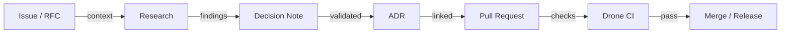

# 🔁 Luna Workflow Overview

This document summarises the end-to-end flow for decisions and code changes in **Luna Assistant Core**.

---

## 📌 Key Steps

1. **RFC / Issue**: open a ticket using the RFC template when a structural change is proposed.
2. **Research**: capture findings via the Research issue template.
3. **Decision Note**: draft using `docs/PROCESS/decision-note-template.md`.
4. **ADR**: formalise the decision in `docs/DECISIONS/` (template `ADR-0000-template.md`), update the index.
5. **Pull Request**: implement changes referencing the ADR, use the PR template, and review domain checklists.
6. **Drone CI**: ensure `cargo build/test`, `cargo clippy`, and `trivy` all pass.
7. **Release**: merge when checklist and CI are green; label appropriately.

---

## 🧭 Quick Reference

- ADR template: `docs/DECISIONS/ADR-0000-template.md`
- ADR index: `docs/DECISIONS/index.md`
- Domain checklists: `docs/PROCESS/`
- Governance overview: `docs/AI-GOVERNANCE.md`
- Developer guide: `docs/DEVELOPER.md`
- Contributing guide: `docs/CONTRIBUTING.md`
